<!DOCTYPE html>
<html>
<head>
	<title></title>
	  <meta charset="UTF8">
  <meta name="viewport" content="width=devices-width,initial-scale=1.0">
  <meta http-equip="X-UA-Compaitable" content="ie=edge">
<link rel="stylesheet" type="text/css" href="https://stackpath.bootstrapcdn.com/bootstrap/4.4.1/css/bootstrap.min.css" integrity="sha384-Vkoo8x4CGsO3+Hhxv8T/Q5PaXtkKtu6ug5TOeNV6gBiFeWPGFN9MuhOf23Q9Ifjh" crossorigin="anonymous">
<link rel="stylesheet" type="text/css" href="https://stackpath.bootstrapcdn.com/font-awesome/4.7.0/css/font-awesome.min.css">

<link rel="stylesheet" type="text/css" href="ptv.css">

</head>
<body>
	

 <nav class="navbar navbar-expand-lg navbar-light bg-light fixed-top" style="background-color: #192332 !important; border-top: 10px solid #54c4c1;">
  <a class="navbar-brand" href="#"><b style="color: #fff; font-family: cursive; font-size: unset;">GWALIOR TOURISM</b></a>
  <button class="navbar-toggler" type="button" data-toggle="collapse" data-target="#navbarSupportedContent" aria-controls="navbarSupportedContent" aria-expanded="false" aria-label="Toggle navigation">
    
  </button>

  

    <ul class="navbar-nav mr-auto">
      <li class="nav-item active">
        <a class="nav-link" href="GwlTourism.html"><b style="border: 2px solid dodgerblue; padding: 7px;">Home</b>(current)</a>
      </li>
      <li class="nav-item dropdown">
        <a class="nav-link dropdown-toggle" href="ptv.html" id="navbarDropdown" role="button" data-toggle="dropdown" aria-haspopup="true" aria-expanded="false"><b>
          Places To Visit</b>
        </a>
        

          <a class="dropdown-item" href="ptv.html">Gwalior Fort</a>
          <a class="dropdown-item" href="ptv.html">Jai-Vilas palace</a>
          <a class="dropdown-item" href="ptv.html">Gujari Mahal [State Archaeological Museum]</a>
          <a class="dropdown-item" href="ptv.html">Man Mandir palace</a>
          <a class="dropdown-item" href="ptv.html">Tomb of Tansen</a>
          <a class="dropdown-item" href="ptv.html">Teli Ka Mandir</a>
          

          <a class="dropdown-item" href="ptv.html">And Many More....</a>
        

      </li>
      <li class="nav-item">
        <a class="nav-link" href="hotel.html"><b>Hotels</b></a>
      </li>
      <li class="nav-item">
        <a class="nav-link" href="food.html"><b>Restaurant</b></a>
      </li>
      <li class="nav-item">
        <a class="nav-link" href="#"><b>How To Reach</b></a>
      </li>
      <li class="nav-item">
        <a class="nav-link" href="contact.html"><b>Contact Us</b></a>
      </li>
    </ul>
  
 
  

</nav>

 
 

  <ol class="carousel-indicators">
    <li data-target="#carouselExampleCaptions" data-slide-to="0" class="active"></li>
     <li data-target="#carouselExampleCaptions" data-slide-to="1"></li>
    <li data-target="#carouselExampleCaptions" data-slide-to="2"></li>
    <li data-target="#carouselExampleCaptions" data-slide-to="3"></li>
  <li data-target="#carouselExampleCaptions" data-slide-to="4"></li>
    </ol>
  

    

      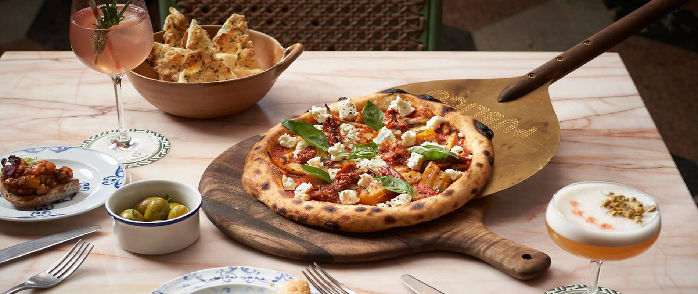
      

        
        <h2>Gwalior Resturants</h2>
      

    

    

      
      

        <h2><b>IceCream</b></h2>
    

    

    

      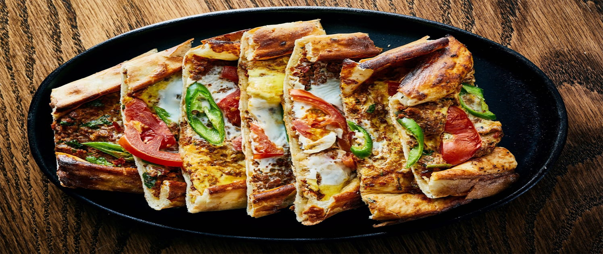
      

        <h2><b>Cafe</b></h2>
      

    

    

      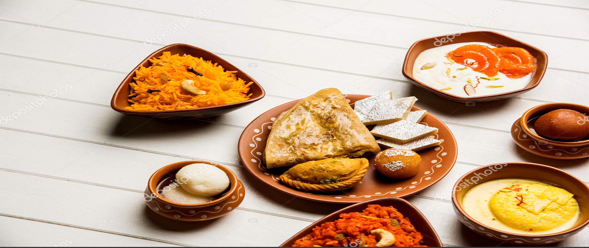
      

        <h2><b>Sweet</b></h2>
      

    

    

      
      

        <h2><b>Club & Lounge</b></h2>
      

    

  

  <a class="carousel-control-prev" href="#carouselExampleCaptions" role="button" data-slide="prev">
    
    Previous
  </a>
  <a class="carousel-control-next" href="#carouselExampleCaptions" role="button" data-slide="next">
    
    Next
  </a>

  

  
 
    <h2>Our Services</h2>
    

      

        <a href="#r">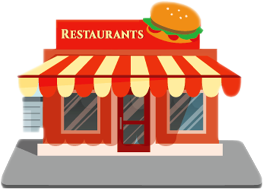</a>
        <a href="#r"><h4 class="mt-4">Restaurants</h4></a>
      

      

        
        <a href="#d"><h4 class="mt-4">Dessert</h4></a>
      

      

        
        <a href="#c"><h4 class="mt-4">Cafe</h4></a>
      

      

        
        <a href="#s"><h4 class="mt-4">Sweet</h4></a>
      

      

        
        <a href="#b"><h4 class="mt-4">Bakeries</h4></a>
      

      

        
        <a href="#l"><h4 class="mt-4">Club & Lounge</h4></a>
      

    

  

  

   
   
   
  

  

    <h1 style="text-align: center;">Restaurants</h1>
     
    

  

    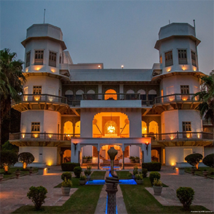
    

      <h5 class="card-title"><u>Silver Saloon</u></h5>
       
      
 Rating: 3.8 
 Usha Kiran Palace, Jayendraganj, Gwalior, Madhya Pradesh.

    

    
  

  

    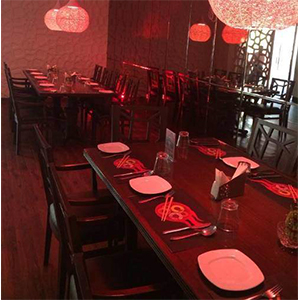
    

      <h5 class="card-title"><u>Moti Mahal Deluxe</u></h5>

      
 Rating: 3.9 
 1st Hotel Regency Square Bus Stand Road, near Bus Stand, New Balwant Nagar, Gwalior, Madhya Pradesh.

    

    
  

  

    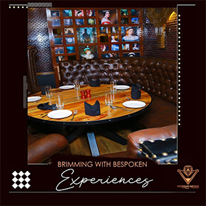
    

      <h5 class="card-title"><u>Virasat The Heritage</u></h5>
      
 Rating: 3.7 
 Main Rd, Jayendraganj, Lashkar, Gwalior, Madhya Pradesh.

    

    
  

  

    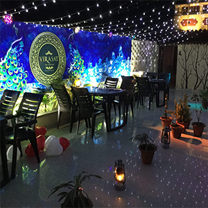
    

      <h5 class="card-title"><u>Victorian Vantage</u></h5>
      
 Rating: 3.8 
Sanatan Dharam Mandir Rd,Near Chammber of Commerce, Lashkar, Gwalior, Madhya Pradesh.

    

    
  

  

    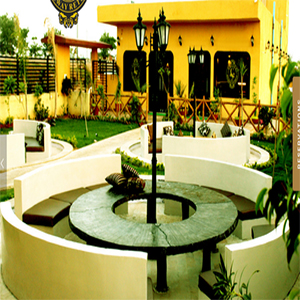
    

      <h5 class="card-title"><u>Cocina Highway Retreat</u> </h5>
     
 Rating: 4.1 
AH-43 Bypass Road, near ITM GLOBAL SCHOOL, Turari, Gwalior, Madhya Pradesh.

    

    
  

  

  

    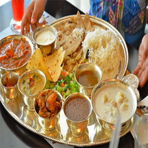
    

      <h5 class="card-title"><u>Panchavati Gaurav</u></h5>
      
 Rating: 4.2 
Fortune Plaza F-01,First Floor, Madhav Rao Scindia Marg, City Center, Patel Nagar, Gwalior, Madhya Pradesh.

    

  

  

    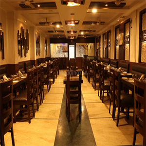
    

      <h5 class="card-title"><u>Volga Restaurant</u></h5>
       
      
 Rating: 3.9 
OPPOSITE RAJEEV PLAZA ,NEAR PARASMANI MALL, Jayendraganj, Lashkar, Gwalior, Madhya Pradesh.

    
  

  

    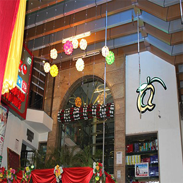
    

      <h5 class="card-title"><u>Alfanzo</u></h5>
       
      
 Rating: 4.0 
Madhav Rao Scindia Marg, City Center, Raksha Vihar, Lashkar, Gwalior, Madhya Pradesh.

    
  

  

    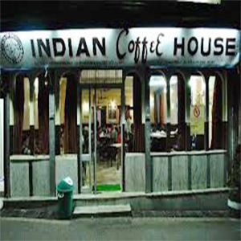
    

      <h5 class="card-title"><u>Indian Coffee House</u></h5>
      
 Rating: 4.1 
Nera Hotel India, Station Rd, LNUPE Campus, Lashkar, Gwalior, Madhya Pradesh.

  

  

      <h3 class="text-muted" style="text-align: center; margin-top: 235px;"><a href=""><u>View More</u> ></a></h3>
    

  

  
 

  
  

  

    <h1 style="text-align: center;">Dessert</h1>
     
    

  

    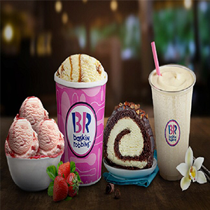
    

      <h5 class="card-title"><u>Baskin Robbins</u></h5>
      
Rating: 4.5 
Saugat Apartment, Govindpuri, Gwalior, Madhya Pradesh.

    

    
  

  

    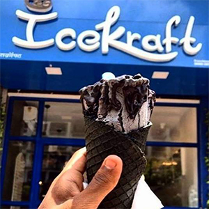
    

      <h5 class="card-title"><u>Icecraft</u></h5>

      
 Rating: 4.1 
In front of MP board office, above SBI bank, City Center, Patel Nagar, Gwalior, Madhya Pradesh.

    

    
  

  

    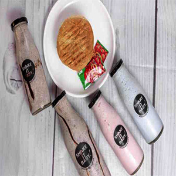
    

      <h5 class="card-title"><u>Shake It Baby</u></h5>
      
 Rating: 4.2 
Saugat Apartments, University Rd, Govindpuri, Gwalior, Madhya Pradesh.

    

    
  

  

    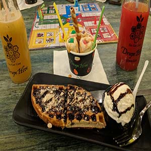
    

      <h5 class="card-title"><u>Drupe Hive</u></h5>
      
 Rating: 4.0 
 Harishankar Puram, Shiram Colony, Lashkar, Gwalior, Madhya Pradesh.

    
  

  

    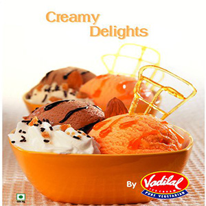
    

      <h5 class="card-title"><u>Vadilal Icecream</u> </h5>
     
 Rating: 4.0 
 City Center, Tulsi Vihar Colony, Gwalior, Madhya Pradesh.

    

    
  

  

  

    
    

      <h5 class="card-title"><u>Top And Town Ice Cream Parlour</u></h5>
      
Rating: 4.3 
Gwalior, Madhav Nagar, Lashkar, Gwalior, Madhya Pradesh.

    

  

  

    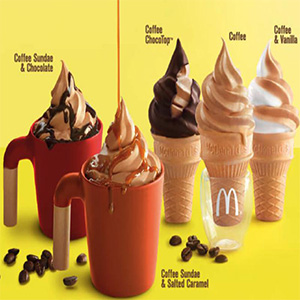
    

      <h5 class="card-title"><u>McDonald's Ice Cream</u></h5>
      
 Rating: 3.9 
Deendayal City Mall G 28 A Lashkar, Shinde Ki Chhawani, Gwalior, Madhya Pradesh.

    
  

  

    
    

      <h5 class="card-title"><u>Amul Ice Cream Parlour</u></h5>
      
Rating: 5.0 
Roxy Rd, in front of C.Sky Front Of C.Sky Madhya Pradesh, Roxy Pul, Lashkar, Gwalior, Madhya Pradesh.

    
  

  

    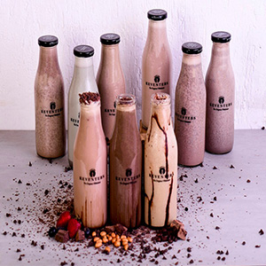
    

      <h5 class="card-title"><u>Keventers</u></h5>
      
 Rating: 4.1 
Oppo. Railway Station, Racecourse Rd, LNUPE Campus, Kampoo, Gwalior, Madhya Pradesh.

  

  

      <h3 class="text-muted" style="text-align: center; margin-top: 235px;"><a href=""><u>View More</u> ></a></h3>
    

  

  
 

  
  

  

    <h1 style="text-align: center;">Cafe</h1>
     
    

  

    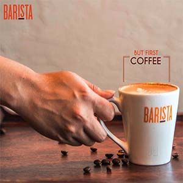
    

      <h5 class="card-title"><u>Barista</u></h5>
       
      
Rating: 4.1 
Ground Floor Neo Meridian Shopping Gallery Road, Gulmohar City, Gwalior, Madhya Pradesh.

    

    
  

  

    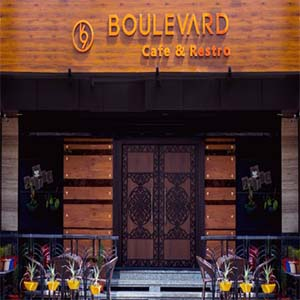
    

      <h5 class="card-title"><u>Boulevard 69 Cafe & Restro</u></h5>

      
 Rating: 3.9 
 G-5, The Empire, City Center, Tulsi Vihar Colony, Gwalior, Madhya Pradesh.

    

    
  

  

    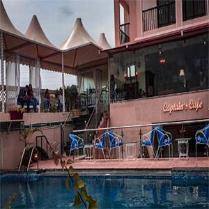
    

      <h5 class="card-title"><u>Captain's Cafe</u></h5>
       
      
 Rating: 4.1 
2nd Floor, Garden Palace, New Collectorate Rd, above GST BHAWAN, Gwalior, Madhya Pradesh.

    

    
  

  

    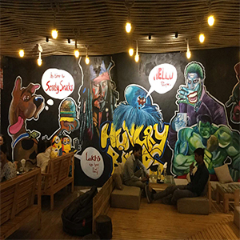
    

      <h5 class="card-title"><u>Hungry Birds</u></h5>
       
      
 Rating: 4.0 
1st Floor 647 Roshni Ghar Road, Near, Old High Court, Lashkar, Gwalior, Madhya Pradesh.

    
  

  

    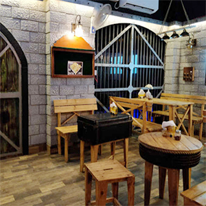
    

      <h5 class="card-title"><u>Cafe Prizon</u> </h5>
       
     
 Rating: 3.8 
 F - 126, Vijay Nagar, Chetakpuri, Lashkar, Gwalior, Madhya Pradesh.

    

    
  

  

  

    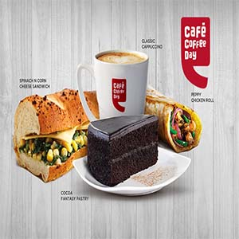
    

      <h5 class="card-title"><u>Café Coffee Day</u></h5>
       
      
Rating: 4.1 
Silver Estate Shopping Complex, University Rd, New Balwant Nagar, Gwalior, Madhya Pradesh.

    

  

  

    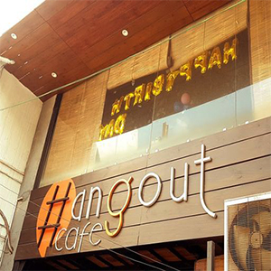
    

      <h5 class="card-title"><u>Hangout Cafe</u></h5>
       
      
Rating: 4.0 
City Center, Raksha Vihar, Lashkar, Gwalior, Madhya Pradesh.

    
  

  

    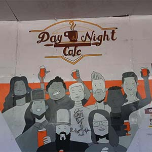
    

      <h5 class="card-title"><u>Day & Night Cafe</u></h5>
      
Rating: 4.3 
near vaishya and mukerji petrol pump, New Saket Nagar, Durgapuri, Gwalior, Madhya Pradesh.

    
  

  

    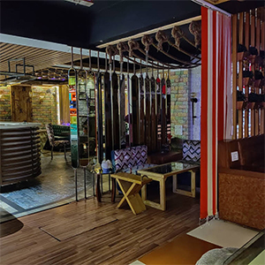
    

      <h5 class="card-title"><u>Apsara happy hours</u></h5>
      
 Rating: 4.1 
108, Nai Sadak, Sathe Ki Goth, Bakshi Ki Goth, Gwalior, Madhya Pradesh.

  

  

      <h3 class="text-muted" style="text-align: center; margin-top: 235px;"><a href=""><u>View More</u> ></a></h3>
    

  

  
 

  
  

  

    <h1 style="text-align: center;">Sweet</h1>
     
    

  

    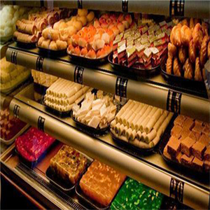
    

      <h5 class="card-title"><u>Jai Bholenath Misthan Bhandar</u></h5>

      
Rating: 3.9 
Mochi Oli, &, Vivekanand Marg, Daulat Ganj, Gwalior, Madhya Pradesh.

    

    
  

  

    
    

      <h5 class="card-title"><u>Bahadura Sweets</u></h5>
       
      
Rating: 4.5 
Lohiya Bazaar Road Near, Bajaj Oli, Naya Bazaar, Gwalior, Madhya Pradesh.

    

    
  

  

    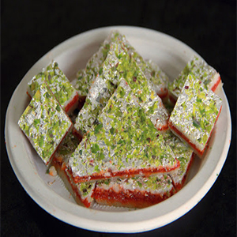
    

      <h5 class="card-title"><u>Shan-Shaukat</u></h5>
       
      
 Rating: 3.9 
Maharani Laxmibai Marg, Nogja Rd, opposite to Naval Flower, Shinde Ki Chhawani, Gwalior, Madhya Pradesh.

    

    
  

  

    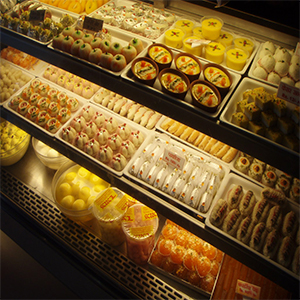
    

      <h5 class="card-title"><u>Param Food Complex</u></h5>
      
 Rating: 4.0 
Near, S K V Rd, Padav, Basant Vihar Colony, Lashkar, Gwalior, Madhya Pradesh.

    
  

  

    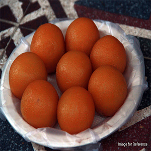
    

      <h5 class="card-title"><u>Alfanzo</u> </h5>
       
     
 Rating: 4.0 
Madhav Rao Scindia Marg, City Center, Raksha Vihar, Lashkar, Gwalior, Madhya Pradesh.

    

  

 

  <a href=""><h3 style="text-align: center;"><u>View More</u> ></h3></a>

  

 

 
  

  

    <h1 style="text-align: center;">Bakeries</h1>
     
    

  

    
    

      <h5 class="card-title"><u>Lush Eggless Cookies n Cakes</u></h5>
    
      
Rating: 4.0 
Ground Parimal Building, AG Office Rd, Chetakpuri, Chowk, Gwalior, Madhya Pradesh.

    

    
  

  

    
    

      <h5 class="card-title"><u>Cooks Fast Food & Bakery</u></h5>

      
 Rating: 4.2 
Patankar Bazaar, Patankar Bazar, Jayendraganj, Shinde Ki Chhawani, Gwalior, Madhya Pradesh.

    

    
  

  

    
    

      <h5 class="card-title"><u>Crisp Corner</u></h5>
       
      
 Rating: 4.2 
Shastri Market, Maharani Laxmibai Marg, Padav, Gwalior, Madhya Pradesh.

    

    
  

  

    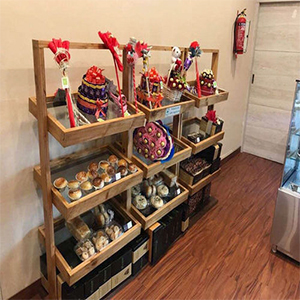
    

      <h5 class="card-title"><u>FNPCakes n more</u></h5>
      
Rating: 4.3 
G-183, Green Garden Rd, City Center, Patel Nagar, Gwalior, Madhya Pradesh.

    
  

  

    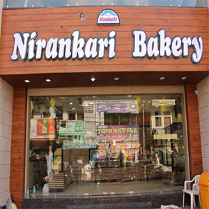
    

      <h5 class="card-title"><u>Nirankari Bakery</u> </h5>
       
     
Rating: 4.4 
Near Police Station, Janak Ganj, Jiyaji Chowk, Gwalior, Madhya Pradesh.

    

    
  

  

  

    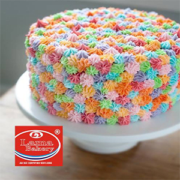
    

      <h5 class="card-title"><u>Lama Bakery</u></h5>
      
Rating: 4.2 
Ram Mandir Chauraha Bank Of Maharashtra, Lashkar, Gwalior, Madhya Pradesh.

    

  

  

    
    

      <h5 class="card-title"><u>Popular Bakery</u></h5>
      
Rating: 3.8 
Phalka Bazar, Phalka Bazar Rd, Lashkar, Gwalior, Madhya Pradesh.

    
  

  

    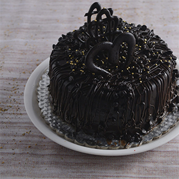
    

      <h5 class="card-title"><u>F&C Bakery</u></h5>
      
 Rating: 3.9 
Ram mandir, near hemu cheela ram mandir, Lashkar, Gwalior, Madhya Pradesh.

    
  

  

    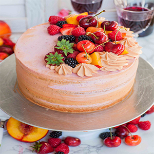
    

      <h5 class="card-title"><u>Glorious Bakers</u></h5>
      
Rating: 4.6 
Shabad Pratap Ashram, Fort Rd, Vinay Nagar, Gwalior, Madhya Pradesh.

  

  

      <h3 class="text-muted" style="text-align: center; margin-top: 235px;"><a href=""><u>View More</u> ></a></h3>
    

  

  
 

  
 

  

    <h1 style="text-align: center;">Club & Lounge</h1>
     
    

  

    
    

      <h5 class="card-title"><u>MEDUSA-Nightclub & Lounge</u></h5>

      
Rating: 3.8 
Madhav Rao Scindia Marg, City Center, Raksha Vihar, Lashkar, Gwalior, Madhya Pradesh.

    

    
  

  

    
    

      <h5 class="card-title"><u>Blue Lounge (Restaurant & pub)</u></h5>
      
 Rating: 4.0 
2nd Floor,Dindayal City Mall, Maharani Laxmibai Marg, Gwalior, Madhya Pradesh.

    

    
  

  

    
    

      <h5 class="card-title"><u>Kabooz Cafe & Lounge</u></h5>
       
      
 Rating: 3.7 
 Near income tax office, City Center, Kailash Vihar Colony, Gwalior, Madhya Pradesh.

    

    
  

  

    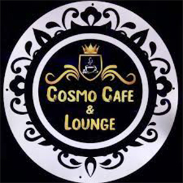
    

      <h5 class="card-title"><u>Cosmo Cafe & lounge</u></h5>
       
      
 Rating: 3.9 
 MP Nagar City Center Road, near Anup Mishra Petrol Pump, Gwalior, Madhya Pradesh.

    
  

  

    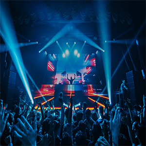
    

      <h5 class="card-title"><u>Nirvana Club & Lounge</u> </h5>
       
     
 Rating: 4.1 
Tapovan Forest Colony, Paras Vihar Colony, Vijaynagar, Gwalior, Madhya Pradesh.

    

  

 

  <a href=""><h3 style="text-align: center;"><u>View More</u> ></h3></a>

  

 

  

   <h2 style="color: #000"><b class="s">"Explore"Gwalior Restaurants
    </h2>
    

     
<iframe  width="100%" height="500" frameborder="0" style="border:0;"src="https://www.google.com/maps/embed?pb=!1m16!1m12!1m3!1d28637.394087896857!2d78.1994944919547!3d26.207272579837017!2m3!1f0!2f0!3f0!3m2!1i1024!2i768!4f13.1!2m1!1sRESTURANTS%20in%20gwalior!5e0!3m2!1sen!2sin!4v1587318603532!5m2!1sen!2sin" allowfullscreen=""></iframe>

<footer class="page-footer font-small cyan darken-3" style="background-color: #21d192">

  <!-- Footer Elements -->

    <!-- Grid row-->
    

      <!-- Grid column -->
      

         

          <!-- Facebook -->
          <a class="fb-ic">
            <i class="fa fa-facebook-f fa-lg white-text mr-md-5 mr-3 fa-2x"> </i>
          </a>
          <!-- Twitter -->
          <a class="tw-ic">
            <i class="fa fa-twitter fa-lg white-text mr-md-5 mr-3 fa-2x"> </i>
          </a>
          <!--Instagram-->
          <a class="ins-ic">
            <i class="fa fa-instagram fa-lg white-text mr-md-5 mr-3 fa-2x"> </i>
          </a>
          <!--Pinterest-->
          <a class="pin-ic">
            <i class="fa fa-whatsapp fa-lg white-text fa-2x"> </i>
          </a>
        

      

      <!-- Grid column -->

    

    <!-- Grid row-->
  <!-- Footer Elements -->

  <!-- Copyright -->
  

    <a style="color: white;">© Tourism @ 2020 :</a>
    <a href="GwlTourism.html">GwlTourism.com</a>
  

  <!-- Copyright -->

</footer>

</body>
</html>
